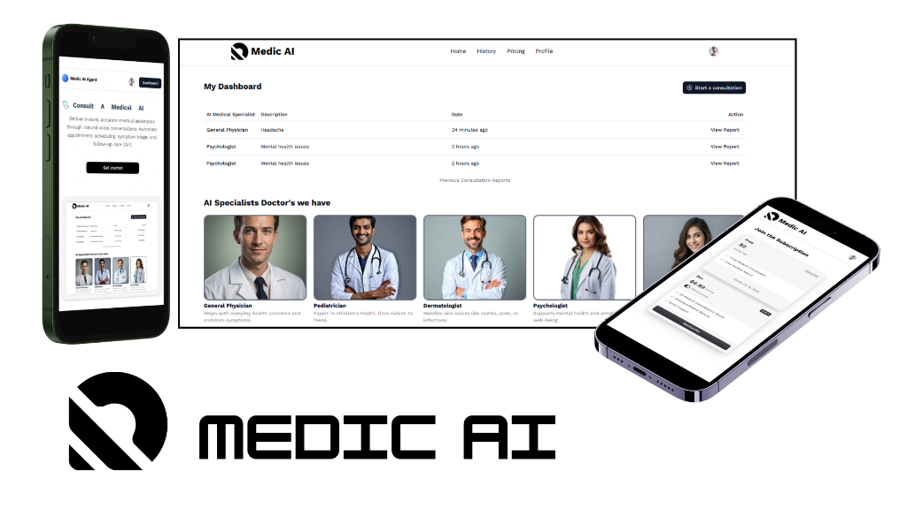

# Medic AI Agent



## Overview

Medic AI Agent is a comprehensive medical assistance platform designed to facilitate interaction between patients and AI-powered medical specialists. It allows users to consult with various AI doctors (General Physician, Psychologist, Pediatrician, etc.), manage their health dashboard, and access medical history.

## Features

-   **AI Medical Consultation:** Converse with specialized AI agents for instant medical advice and triage.
-   **Dashboard:** A centralized hub to view consultation history, reports, and available specialists.
-   **Specialist Selection:** Choose from a variety of AI specialists tailored to specific health needs.
-   **Responsive Design:** Optimized for both desktop and mobile usage.
-   **Secure Authentication:** User authentication and management via Clerk.

## Tech Stack

-   **Framework:** [Next.js](https://nextjs.org/) (App Router)
-   **Language:** TypeScript
-   **Styling:** Tailwind CSS
-   **Authentication:** [Clerk](https://clerk.com/)
-   **Database:** [Neon](https://neon.tech/) (PostgreSQL)
-   **ORM:** [Drizzle ORM](https://orm.drizzle.team/)
-   **AI Integration:** OpenAI / Vapi AI
-   **Icons:** Lucide React, Tabler Icons

## Getting Started

Follow these steps to set up the project locally.

### Prerequisites

-   Node.js (v18 or higher)
-   npm or yarn

### Installation

1.  **Clone the repository:**

    ```bash
    git clone <repository-url>
    cd medic
    ```

2.  **Install dependencies:**

    ```bash
    npm install
    # or
    yarn install
    ```

3.  **Set up environment variables:**

    Create a `.env` file in the root directory and add the necessary environment variables. You will need keys for:
    -   Clerk (NEXT_PUBLIC_CLERK_PUBLISHABLE_KEY, CLERK_SECRET_KEY)
    -   Database (DATABASE_URL)
    -   OpenAI / AI Provider Keys

    Example `.env`:
    ```env
    NEXT_PUBLIC_CLERK_PUBLISHABLE_KEY=pk_test_...
    CLERK_SECRET_KEY=sk_test_...
    DATABASE_URL=postgresql://...
    ```

4.  **Run the development server:**

    ```bash
    npm run dev
    ```

    Open [http://localhost:3000](http://localhost:3000) with your browser to see the result.

## Usage

-   **Sign Up/Login:** Create an account to access the dashboard.
-   **Start Consultation:** Click on "Start a consultation" or select a specialist from the dashboard.
-   **View History:** Access previous consultation reports from the dashboard.

## Learn More

To learn more about Next.js, take a look at the following resources:

-   [Next.js Documentation](https://nextjs.org/docs) - learn about Next.js features and API.
-   [Learn Next.js](https://nextjs.org/learn) - an interactive Next.js tutorial.